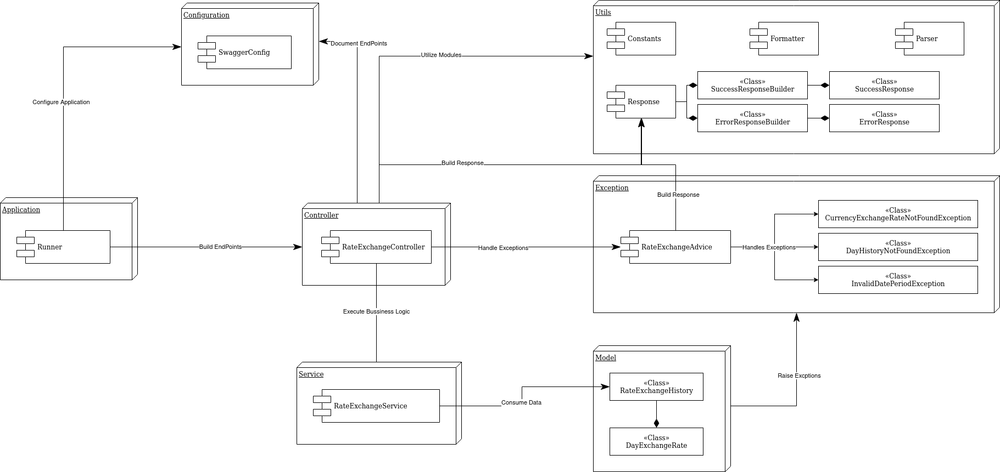

# Description
RateExchanger application is a REST-API that helps in retrieving and convert different currencies against `Euro` currency.
The application loads data from a `CSV` file which contains history of exchange rates from [Link](https://www.ecb.europa.eu/stats/policy_and_exchange_rates/euro_reference_exchange_rates/html/index.en.html).

### Dependencies
- `Maven`
- `SpringBoot`
- `Swagger`
- `junit`

### Endpoints
- Swagger Documentation: `http://localhost:8080/swagger-ui.html`
- API v1: `http://localhost:8080/api/v1`

## Diagrams
- Component Diagram: 
